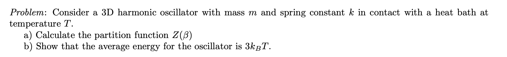

A very standard question in introductory statistical mechanics courses is:

The solution can be obtained almost mindlessly, by using the appropriate formulas. It goes something like this: the system's Hamiltonian is 

$$
H( x, p)=\frac{ p^2}{2m} + \frac{k  x^2}{2}.
$$

When in the canonical ensemble, i.e. in contact with a heat bath such that the system's temperature, volume and particle number are fixed, the phase-space probability density function is given by the Gibbs distribution

$$\rho({x,p})=\frac{1}{Z(\beta)} \exp\left[-\beta H(x,p) \right],\quad \beta\equiv(k_B T)^{-1}$$

where the normalization factor $Z(\beta)$ is called the partition function. Explicitly, letting $\omega^2 \equiv k/m$ be the natural oscillator frequency,

$$
\begin{align*}
Z(\beta) &= \int_{\mathbb R^3} \int_{\mathbb R^3} d^3x\, d^3p \, \exp \left[-\beta \left(\frac{p^2}{2m} + \frac{m\omega^2x^2}{2} \right) \right]\\
&=\int_{\mathbb R^3} d^3x \, \exp \left[-\beta \frac{m\omega^2x^2}{2}  \right] \;\int_{\mathbb R^3} d^3p \, \exp \left[-\beta \frac{p^2}{2m}  \right]\\
&= \left(\frac{2\pi}{\beta m\omega^2} \right)^{3/2} \left(\frac{2\pi m}{\beta} \right)^{3/2}\\
&= \left(\frac{2\pi}{\beta \omega} \right)^3.
\end{align*}
$$

This is the partition function for item (a).

For item (b), we recall the following formula: in the canonical ensemble, the mean energy of the system can be expressed simply from the partition function as

$$\langle E \rangle=-\frac{d}{d\beta} \log Z(\beta) = -\frac{Z'(\beta)}{Z(\beta)}$$

To see why this is true, it is enough to write the expected value as the integral 

$$ \langle E\rangle \equiv \mathbb E[H] = \int _{\mathbb R^6} d^3x d^3p\, H(x,p) \frac{e^{-\beta H(x,p)}}{Z(\beta)}$$

and realize this is the minus the derivative of the PDF with respect to $\beta$ up to a constant $-1/Z(\beta)$. The result easily follows.

> Throughout this article, when expressing means of random variables, I will use the mathematicians' notation $\mathbb E[\ \cdot\ ]$  and the physicists' notation $\langle \ \cdot \ \rangle$ interchangibly. The former is clearer when dealing with iterated expectation or conditional expectations, whereas the latter leads to slightly less clutter, at least for me.

Then, it is straightforward to compute the mean energy. Since $-\log Z(\beta) = 3 \log \beta + $ terms that do not depend on $\beta$, we find

$$\langle E\rangle =\frac{3}{\beta} = 3 k_BT.$$

This result is in line with the [equipartition theorem](https://en.wikipedia.org/wiki/Equipartition_theorem): for every quadratic degree of freedom in the Hamiltonian, the particle gains a mean energy of $(1/2) k_BT$. Since there are six such degrees of freedom ($x^2$, $y^2$, $z^2$, $p_x^2$, $p_y^2$ and $p_z^2$) the total energy is $6 \times 1/2 = 3$ times $k_BT$. 

This was a relatively easy calculation. When taking this class, about 10 years ago, I remember really enjoying seeing how the equipartition theorem derived from Gaussian integrals of each degree of freedom. I was able to connect the calculation to previous knowledge in my mind, so everything was good.

Or, almost good. I didn't feel comfortable with having a harmonic oscillator (which I visualized as a microscopic pendulum) have a temperature. It didn't match my mental image, namely, that of a gas: a system with many degrees of freedom, with each particle carrying an energy 

$$\frac{mv^2}{2} \sim k_BT$$

so that temperature served as a macroscopic ruler for total energy and represented the "jiggling motion" of the particles. How about a system with *few* degrees of freedom, like the harmonic oscillator? Would this still apply?

I had to go back to basicas and rebuild my mental picture of temperature, which took me through an interesting journey across the foundations of thermodynamics and statistical mechanics. In this article, I want to lay down the main learnings from this experience.

# The gist of equilibrium statistical mechanics

When we consider a system in a **statistical ensemble**, this means we admit our lack of knowledge about the environment's degrees of freedom and **promote the observables to random variables**, assuming that the time-averaged behavior of the system can be equivalently described by a probability space with time no longer considered.

 For example, by **coupling** a system with degrees of freedom $x(t),  p(t)$ to a heat reservoir characterized by a temperature $T$ (what we usually call the canonical ensemble) we are formally replacing 
 
 $$\boxed{x(t),  p(t) \longrightarrow  X,  P \sim \mathrm{Gibbs}(H)}$$
 
 where $H = H(x,p)$ is the Hamiltonian of the system  when not coupled to the heat reservoir, and $\mathrm{Gibbs}(H)$ is the distribution with probability density
 
 $$\rho(x,p)  d x\, d  p = \frac{\exp{\displaystyle\{-\beta H( x,p)}\}  d  x  d  p}{\displaystyle\int \exp{\{-\beta H( x',  p')}\}   d x' \, d  p'},\quad\text{ with } \beta \equiv \frac{1}{k_B T},$$

where the integral is taken over phase space. As said above, the key assumption is that **time averages reduce to ensemble expectations**, in the sense that

$$\lim_{T\to\infty}\langle \cdot \rangle_T \longrightarrow \mathbb E_\mathrm{Gibbs}[\cdot ]$$

Standard equilibrium statistical mechanics is all about picking the right "statistical ensemble" (= probability space) to make expectations match experimentally-measurable time averages. 

For example, for a system which is isolated and does not undergo external influences, we know that energy is conserved. Furthermore - and this is a *hypothesis*, not a proof - we expect that all microstates which share this energy are *equally probable*, and hence the correct long-term behavior is that where each microstate is visited an equal amount of time. The probability distribution is therefore

$$\rho( {x},  {p}) \,d  {x} \, d  {p} =\delta(H( {x,p})-E)  \,d {x}\, d  {p} $$

i.e. it picks up the $H=E$ hypersurface. This is, of course, the microcanonical ensemble. There is no unique, *a priori* notion of temperature -- cf [here](https://en.wikipedia.org/wiki/Microcanonical_ensemble#Thermodynamic_quantities).

If we further choose to artificially break down the system into two subparts, namely, the subsystem we care about with relatively few degrees of freedom, and an environment, which we assume to have many degrees of freedom, then we find that the temperature becomes a quantity that is common between both -- again, for the long-term, equilibrium behavior, which is no longer dependent on time.

Then, **what does it mean to e.g. consider the classical textbook problem of "the harmonic oscillator in the canonical ensemble"?**

It means, in the language that we have been using so far, that we no longer consider the *solutions* to Hamilton's equations

$$\begin{align*}
x(t) &= x(0) \cos \omega t + \frac{p(0)}{m \omega } \sin \omega  t \\ 
p(t) & = p(0) \cos \omega t - m \omega x(0) \sin \omega t,\qquad x(0),p(0)\text{ constant},
\end{align*}$$

but rather that we have *formally replaced* these by random variables $X$ and $P$. A particle which would otherwise undergo Hamiltonian dynamics, when conditioned to be in equilibrium with a heat bath at temperature $T$, no longer has well-defined position and momentum; instead, observables can be computed by statistical moments in a line of thought very similar to quantum mechanics.

Also, notice that the **mechanism** by which our system is kept in equilibrium with the environment is assumed irrelevant. Whatever it is, its role is to keep the average energy at $(3/2) k_B T$ (and higher moments at whatever values they take).

This is the first part of the answer to our question: I can properly define temperature for a finite system like a harmonic oscillator by assuming ignorance about the interaction between the system and the heat bath, and just letting it inherit the bath's temperature.

# Constructing the system-bath interaction

But how? By what mechanism can I visualize the system coupling to the bath and thermalizing?

"It doesn't matter", says thermodynamics. As long as you are in *equilibrium* with the bath (whatever this means) then *how* that equilibrium is achieved does not matter. This is why thermodynamics can be applied from anything, from an engine, to an oven, to a whole star.

But let us push this line of thought further. Ideally, we would be able to construct, mathematically, a deterministic coupling between the two systems which would converge to a thermal system as time evolves. 

The **Caldeira-Leggett model** [2] was introduced in 1981 as a simple model connecting a deterministic system to a heat bath. We will follow the derivation in Zwanzig's book [1], focusing on the classical (non-quantum) case.

We consider a 1D system described by the Hamiltonian

$$H_S = \frac{p^2}{2m}+U(x)$$

where $U$ is an arbitrary potential. This describes a single particle system if $p, x \in \mathbb R^3$, but it can describe a many-body system as well, and can easily be generalized to many different masses under the replacement $p^2/m \to p^T M^{-1} p$. For the sake of simplicity, we will call this the "particle Hamiltonian".

We now consider a coupling between this system and a "heat bath" consisting of $N$ oscillators, in the form

$$H_B=\sum_{j=1}^N \left[\frac{p_j^2}{2 m_j} + \frac 12 m_j\omega_j^2 \left(q_j-\frac{\gamma_j}{m_j\omega_j^2 } x \right)^2 \right]$$

Here, $q_j, p_j$ are the canonical coordinates of oscillator $j$, whose normal modes are $\omega_j$. The constants $\gamma_j$ define the coupling strength between the bath and the particle.

With a formal change of variables, by defining a dimensionless scale factor 

$$\alpha_j \equiv \frac{\gamma_j}{m_j \omega_j^2},$$

and redefining constants as

$$m_j \to m_j'= {m_j}\alpha_j^2,\quad q_j\to q_j'= \frac{q_j}{\alpha_j},\quad p_j\to p_j'=\alpha_j {p_j}$$

the bath Hamiltonian becomes

$$H_B=\sum_{j=1}^N \left[\frac{p_j'^2}{2 m_j'} + \frac 12 m_j'\omega_j^2 \left(q_j'- x \right)^2 \right]$$

and we see that it is a sum of independent harmonic oscillators, each having an interaction term with the particle that depends on their relative displacements.

Let us assume that, from $t = -\infty$ to $t=0$, the particle has followed the dynamics specified by the Hamiltonian $H_S$. At $t=0$, we **couple** it to the heat bath such that the Hamiltonian becomes $H = H_S + H_B$, ie. 

$$\boxed{H= \frac{p^2}{2m}+U(x)+H_B=\sum_{j=1}^N \left[\frac{p_j^2}{2 m_j} + \frac 12 m_j\omega_j^2 \left(q_j-\frac{\gamma_j}{m_j\omega_j^2 } x \right)^2 \right]}$$

for $t \geq 0$. 

Hamilton's equations yield

$$\frac{dx}{dt}=\frac{p}{m},\qquad\frac{dp}{dt}=-U'(x)+\sum_{j=1}^N \gamma_j\left(q_j-\frac{\gamma_j}{m_j\omega_j^2} x\right)\tag{$*$}$$

$$\frac{dq_j}{dt}=\frac{p_j}{m_j},\qquad \frac{dp_j}{dt}=-m\omega_j^2q_j+\gamma_jx.$$

We start with the second equation, which can be recast into a second order ODE as

$$\ddot q_j +\omega_j^2 q_j=\frac{\gamma_j}{m_j} x(t).$$

This is, for each $j$, a driven harmonic oscillator. This equation can be solved via variation of parameters (see Appendix 1). The solution is

$$q_j(t) = q_j(0) \cos \omega_j t + \frac{p_j(0)}{m_j\omega_j}\sin \omega_j t + \frac {\gamma_j}{m_j\omega_j} \int_0^t \sin\omega_j(t-t')\,x(t') dt'.$$

By integrating by parts, it can be cast as

$$\begin{align*}
q_j(t)-\alpha_jx(t)=\left(q_j(0)-\alpha_j x(0) \right)\cos \omega_j t + \; \frac{p_j(0)}{m_j \omega_j} \sin \omega_j t\\ 
-\alpha_j \int_0^t\frac{p(t')}{m} \cos \omega_j(t-t') dt'
\end{align*}$$

where, again, we use $\alpha_j = \gamma_j/(m_j \omega_j^2)$ for convenience.

With this expression, we have fully solved the bath's dynamics as functions of the particle's position $x(t)$ and momentum $p(t)$. We can then substitute this back into Eq. $(*)$ to obtain an equation only relating $x$ and $p$:

$$\begin{align*}
\frac{dp}{dt} &=  -U'(x)+\sum_{j=1}^N \gamma_j\left(q_j-\frac{\gamma_j}{m_j\omega_j^2} x\right)\\
&= - U'(x)+\sum_{j=1}^N \gamma_j(q_j(t) - \alpha_j x(t))\\
&=- U'(x)+\sum_{j=1}^N \left[\gamma_j(q_j(0)-\alpha_j x(0)) \cos\omega_j t+ \frac{\gamma_j p_j(0)}{m_j\omega_j} \sin\omega_j t\right]\\
&\qquad\qquad- \sum_{j=1}^N \gamma_j\alpha_j \int_0^t\frac{p(t')}{m} \cos \omega_j(t-t') dt'
\end{align*}$$

We will now define two terms, and explain the reason behind their names later. First, we define the **memory function**

$$K_N(t)=\sum_{j=1}^N \gamma_j\alpha_j \cos \omega_j t = \sum_{j=1}^N\frac{\gamma_j^2}{m_j \omega_j^2} \cos\omega_j t$$

and the **noise function**

$$F_N(t)=\sum_{j=1}^N \left[\gamma_j \left(q_j(0)-\frac{\gamma_j}{m_j \omega_j^2} x(0)\right) \cos\omega_j t+ \frac{\gamma_j p_j(0)}{m_j\omega_j} \sin\omega_j t\right]$$

so that our final integro-differential equation is the so-called **generalized Langevin equation**

$$\boxed{\frac{dp(t)}{dt}=-U'(x(t))-\int_0^t K_N(t-s)\frac{p(s)}{m}ds+F_N(t)}$$

with $p = m \, dx/dt$ the momentum.

## The Langevin equation

Before we dive into the solution to the generalized Langevin equation, it is useful to study the *standard* Langevin equation. 

This equation, also known as a *stochastic differential equation (SDE)*, is a means of considering how random noise affects otherwise deterministic processes. It can be written, generally, as

$$\frac{dx}{dt}=\mu(t,x(t))+\sigma(t,x(t)) \eta(t)$$

where $\mu$ is the so-called drift, and $\sigma \eta$ is the noise. Here, $\eta(t)$ is, for every $t$, a **random variable** modelling the non-deterministic behavior of the system. It is chosen as a *Gaussian random variable* (hence, fully determined by its first two moments) satisfying

$$\boxed{\langle \eta(t) \rangle = 0,\qquad \langle \eta(t) \eta(t')\rangle = \delta(t-t')}$$

with $\delta$ being the Dirac delta distribution. 

There is so much we can discuss on the Langevin equation, the first point being notation: I originally studied this equation from finance books [3], with both different notations and emphases. I detail this in Appendix 2, for those who may be interested.

Let us consider the Langevin equation for a particle in a gas, being constantly bombarded by other randomly moving particles: the classic case of Brownian motion. Newton's second law reads

$$m \frac{dv}{dt}=-\gamma m v + F(t),\quad F(t) = \Gamma \eta(t)$$

where $\Gamma$ is a constant that we must determine. This particle undergoes drag, represented by the force $-\gamma m v$, and a random force $F$ which is Gaussian with mean zero and variance $\Gamma^2$.

Crucially, assume that the gas is at equilibrium at temperature $T$. What we are doing is to basically fix our attention to a single particle out of the many identical particles in the gas, and studying its behavior (hence the naming "tagged particle" usual in this field -- we are picking one particle out of all the others to analyze).

This first-order equation can be solved via an integrating factor, and has formal solution

$$v(t)=v_0 e^{-\gamma t} + \frac 1m \int_0^t e^{-\gamma(t-s)} F(s) ds.$$

Notice that $v_0$ is, in principle, a random variable as well. For us to compute averages, variances etc, it is useful to remember the law of total expectation: for two random variables $X, Y$ it holds

$$\mathbb E[X] = \mathbb E\big[ \mathbb E[X \, \vert \, Y]\big].$$

In words, it means that the mean of, say, $v(t)$, can be computed by first considering $v_0$ as a constant, and then taking the average of the result across $v_0$.

As we describe in Appendix 2, the integral has zero mean:

$$\begin{align*}
\mathbb E\left[\frac 1m \int_0^t e^{-\gamma(t-s)} F(s) ds \, \Bigg \vert \,v_0\right] &= \frac 1m \int_0^t e^{-\gamma(t-s)} \Gamma\, \mathbb E[\eta(s) \, \vert \, v_0 ] ds\\
&= \frac 1m \int_0^t e^{-\gamma(t-s)} \Gamma\, \mathbb E[\eta(s)]ds\\
&=0
\end{align*}$$

where we assumed that $\mathbb E[\eta(s) \, \vert \, v_0 ] = \mathbb E[\eta(s)]$, which is valid, for instance, if the noise term is independent of $v_0$ (which we will assume it is).

Hence, we have found that 

$$\mathbb E[v(t) \, \vert \, v_0] = e^{-\gamma t}  v_0.$$
 
To compute the iterated expectation $\mathbb E\big[ \mathbb E[ v(t) \, \vert \, v_0]\big]$, we use the fact that the tagged particle is from an ideal gas at thermal equilibrium at temperature $T$. We know from kinetic theory (or, equivalently, from equilibrium statistical mechanics) that the velocity $v_0$ will follow a Maxwell-Boltzmann distribution: in 1D, the probability density function is

$$f_0(v_0)dv_0=\sqrt{\frac{m}{2\pi k_BT}} e^{-mv_0^2/2k_BT} dv_0$$

from which follows that 

$$\mathbb E[ v(t)] = \mathbb E\big[ \mathbb E[ v(t) \, \vert \, v_0]\big]=0$$

since the integrand will be an odd function of $v_0$. In other words, we expect a particle under the specified Langevin dynamics to have zero *mean* velocity.

This, however, says nothing about the *fluctuations* on the particle's velocity. We are interested in computing the velocity autocorrelation

$$\mathrm{Cov}[v(t), v(t')] = \mathbb E \Big[(v(t)- \mathbb Ev(t))(v(t')- \mathbb Ev(t')) \Big]=\mathbb E[v(t)v(t')]$$

Again, it is easier to write $\mathbb E[v(t)v(t')] = \mathbb E[\mathbb E[v(t)v(t')\,\vert\, v_0]]$ and start from the conditional average:

$$
\begin{align*}
\mathbb E[v(t)v(t')\,\vert\, v_0] &= \mathbb E \Bigg[
     \Big(
        v_0 e^{-\gamma t} + \frac 1m \int_0^t e^{-\gamma(t-s)} F(s) ds
      \Big) \times \\
      &\qquad \qquad \Big( 
        v_0 e^{-\gamma t'} + \frac 1m \int_0^{t'} e^{-\gamma(t'-s')} F(s') ds'
      \Big)
\Bigg]\\
&=v_0^2 e^{-\gamma(t+t')} + \text{cross terms}  \\
&\qquad +\frac{\Gamma^2}{m^2} \int_0^t ds\int_0^{t'}ds'\, e^{-\gamma(t-s) -\gamma(t'-s')} \mathbb E[\eta(s)\eta(s')]
\end{align*}$$

The cross terms will vanish since $\mathbb E[\int \cdots \eta(s) ds] = 0$. For the double integral, we pick up a factor of $\delta(s-s')$ which will restrict the domain to $s=s'$,  only defined for $[0, \min(t,t')]$. Hence,

$$
\begin{align*}
\mathbb E[v(t)v(t')\,\vert\, v_0] &= v_0^2 e^{-\gamma(t+t')} +\frac{\Gamma^2}{m^2} e^{-\gamma(t+t')} \int_0^{\min(t,t')} e^{2\gamma s} ds\\
&=v_0^2 e^{-\gamma(t+t')} +\frac{\Gamma^2}{2\gamma m^2} e^{-\gamma(t+t')} \big[e^{2\gamma s}\big]_{s=0}^{s=\min(t,t')}
\end{align*}
$$

Using the following identity to symmetrize the minimum

$$\min(t,t') = \frac 12 (t+t') - \frac 12 \vert t-t'\vert,$$

we get

$$\mathbb E[v(t)v(t')\,\vert\, v_0] = \left(v_0^2 - \frac{\Gamma^2}{2\gamma m^2} \right) e^{-\gamma(t+t')} + \frac{\Gamma^2}{2\gamma m^2} e^{-\gamma\vert t-t'\vert}.$$

This expression will help us find a critical relation between $\Gamma$, which characterizes the noise, and the dissipation factor $\gamma$.

We first study a limiting case. Assume $t=t'$ (i.e. we study the *variance* of $v(t)$) and let $t$ tend to infinity. Rearranging, we see that

$$\mathbb E[v^2(t) \vert v_0]=v_0^2e^{-2\gamma t} + \frac{\Gamma^2}{2\gamma m^2} (1-e^{-2\gamma t})  \; \overset {t\to\infty} \longrightarrow  \; \frac{\Gamma^2}{2\gamma m^2}$$

which does not depend on $v_0$, and hence is the total expectation: 

$$\mathbb E[v(t)^2] = \frac{\Gamma^2}{2\gamma m^2}.$$

On the other hand, we know that, as $t \to \infty$, the particle's velocity just follows the Maxwell-Boltzmann distribution, as it did at $t=0$. In other words, we expect $v(\infty)$, as $v_0$, to follow that distribution, for which

$$\mathbb E[v^2(\infty)] = \frac{k_BT}{m}$$

in one dimension. For consistency, it must hold that

$$\frac{\Gamma^2}{2\gamma m^2} = \frac{k_BT}{m} \implies \boxed{\Gamma= \sqrt{2m \gamma k_BT}}$$

We have thus found that the white noise is a force which depends on the dissipation factor $\gamma$, the particle's mass $m$ and the temperature $T$ via

$$\boxed{F(t) = \sqrt{2m \gamma k_BT}\, \eta(t)}$$

This is an instance of the **fluctuation-dissipation theorem**: both the drag force (which removes energy from the system, trying to push it to rest) and the thermal noise (which adds energy to it) have the **same source**; neither exists if $\gamma = 0$, and the force amplitude $\Gamma$ is not an independent quantity.

We can now tackle the case where $t \neq t'$. By substituting this value in the corresponding equation, we find

$$\mathbb E[v(t)v(t')\,\vert \, v_0]=\left(v_0^2 - \frac{k_BT}{m} \right)e^{-\gamma(t+t')} + \frac{k_BT}{m} e^{-\gamma\vert t-t'\vert}.$$

All terms are deterministic except $v_0^2$; upon taking the expectation with respect to the Maxwell-Boltzmann distribution, however, it exactly cancels the $k_BT/m$ term, and we find the final result

$$\boxed{\mathbb E[v(t)v(t')]=\frac{k_BT}{m} e^{-\gamma\vert t-t'\vert}}$$

Hence, the velocity autocorrelation decays exponentially when the dissipation force is white noise.

## The Fokker-Planck equation

For white noise, the classic theory for stochastic differential equations applies. In particular, there is the very powerful tool known as the [**Fokker-Planck equation**](https://en.wikipedia.org/wiki/Fokker%E2%80%93Planck_equation#Higher_dimensions) or the Kolmogorov forward equation, which allows us to convert a *stochastic* differential equation into a *partial* differential equation for the phase-space probability density of the system. This will be a very important tool in the discussion of the Caldeira-Leggett model, so we briefly present it here.

Consider an SDE described by

$$\frac{dx}{dt}=\mu(t,x(t)) + \sigma(t,x(t)) \eta(t)$$

with $\eta$ Gaussian, where $x$ and $\mu$ are $N$-dimensional vectors, $\eta$ is $M$-dimensional Brownian motion, i.e. whose components satisfy

$$\mathbb E[\eta(t)_i] = 0,\quad \mathbb E[\eta(t)_i\eta(t')_j] = \delta_{ij}\delta(t-t'),$$

and $\sigma$ is an $N\times M$ matrix, then the associated Fokker-Planck equation is a PDE for the phase-space density $p(t,x)$:

$$\boxed{\frac{\partial p}{\partial t} = -\sum_{i=1}^N\frac{\partial}{\partial x_i}[\mu_i p]+ \frac 12 \sum_{i=1}^N \sum_{j=1}^N \frac{\partial^2}{\partial x_i \partial x_j}[D_{ij} p]}$$

where $D=\sigma \sigma^T$, or 

$$D_{ij}(t,x)=\sum_{k=1}^M\sigma_{ik}(t,x) \sigma_{jk}(t,x)$$

is the diffusion matrix.

Let us convert the Langevin equation, which is a 2nd order scalar system for position, into a first-order vector system as

$$\frac{dx}{dt}= v,\quad \frac{dv}{dt}=- \frac{1}{m}U'(x)-\frac{\gamma}{m} v+ \frac{1}{m}F$$

we can identify $N=2, M=1$ and

$$X = 
  \begin{bmatrix} 
  x\\ v 
  \end{bmatrix}, \quad  
  \mu=
  \begin{bmatrix} 
  v \\ - (1/m)U' - \gamma v/m
  \end{bmatrix},\quad 
  \sigma =  
  \begin{bmatrix}
  0 \\
  \sqrt{2\gamma k_B T/m^2}
  \end{bmatrix}
$$

From this, we find

$$D= \sigma \sigma^T=\begin{bmatrix}0 & 0 \\ 0 & 2\gamma  k_B T /m^2\end{bmatrix}$$

and the Fokker-Planck equation becomes

$$\frac{\partial p(t,x,v)}{\partial t}=-\partial_x (vp)-\partial_v \left(\left[-\frac{1}{m}U'(x)- \frac{\gamma v}{m} \right]p \right)+ \frac 12 \frac{2 \gamma k_B T}{m^2} \partial^2_v p$$

where we write $\partial_x \equiv \partial/\partial x$ and  $\partial_v \equiv \partial/\partial v$ for simplicity.

We can simplify by noticing that, considering $v$ and $x$ as independent variables,

$$\partial_x (vp) = v  \partial_xp,\quad \partial_v (p(\partial _xU(x)))=\partial_x U(x) \, \partial_vp$$

obtaining the **Klein-Kramers equation** (also known as the **Kramers-Chandrasekhar** equation):

$$\boxed{\frac{\partial p}{\partial t}+v \partial_x p=\frac 1m \partial_x U(x) \partial_vp+\frac{\gamma}{m} \partial_v \left[ pv+\frac{k_B T}{m} \partial_vp\right]}$$

Notice that this equation is of the form

$$\frac{Dp}{Dt} -\frac 1m\partial_xU \, \partial_vp = \partial_v  j,\quad j\equiv\frac{\gamma}{m}\left[ pv+\frac{k_B T}{m} \partial_vp\right]$$

with $D/Dt = \partial_t + v  \partial_x$ being the material derivative and $j$ is a current. We can interpret this as how the probability density flows over time, spreading around space. 

The Fokker-Planck equation was derived from the Langevin equation, which uses that initial/asymptotic conditions are those of the canonical ensemble Gibbs distribution at temperature $T$.
We now show that this is consistent with the asymptotic limit of the Klein-Kramers equation.

Let $p_\infty(x,v) \equiv \lim_{t\to\infty} p(t,x,v)$. It must hold that $\partial p_\infty/\partial t = 0$, and so we want to solve 

$$-v  \partial_x p_\infty+\frac 1m \partial_x U\,  \partial_vp_\infty+\frac{\gamma}{m} \partial_v \left[ p_\infty v+\frac{k_B T}{m} \partial_vp_\infty\right]=0.$$

Let us guess a solution. *If* we could have the term between square brackets to vanish identically, then for the equation as a hole to hold we will require

$$\partial_v p_\infty=- p_\infty v \frac{m}{k_BT}\quad\text{ and } \quad v \partial_xp_\infty=\frac 1m \partial_xU\,\partial_vp_\infty.$$

The first equation can be integrated directly:

$$\frac{dp_\infty}{p_\infty}=-\frac{m}{k_BT}v dv \implies p_\infty(x,v)  =f(x)\exp \left(-\frac{mv^2}{2k_BT} \right)$$

where $f(x)$ has yet to be determined. The second equation can be rewritten as

$$\partial_x p_\infty = \frac 1m \partial_x U\,\left(-p_\infty \frac{m}{k_BT} \right) \implies\partial_x p_\infty=-\frac{p_\infty}{k_BT} \partial_xU(x)$$

which can be directly integrated as

$$p_\infty(x,v) = g(v)\exp\left(-\frac{U(x)}{k_BT}\right)$$

The only way these two solutions can be harmonized is if

$$\boxed{p_\infty(x,v) \propto\exp\left[-\frac{1}{k_BT} \left(\frac{mv^2}{2}+U(x) \right) \right]}$$

which is exactly the expression for the Gibbs distribution of a system with Hamiltonian 

$$H_\infty(x,p)=\frac{p^2}{2m}+U(x),\quad p\equiv mv$$

in equilibrium with a reservoir with temperature $T$.

## Going back to generalized Langevin

Having extensively studied properties of the Langevin equation, both from the SDE and PDE sides, we now proceed to the generalized one. We repeat it here for convenience, using velocity $v(t)$ instead of momentum $p(t)$:

$$
m \frac{dv(t)}{dt}=-U'(x(t))- \int_0^t K_N(t-s)v(s) ds+  F_N(t).
$$

Notice that this *formally* reduces to the standard Langevin equation 

$$
m \frac{dv(t)}{dt}= \gamma m v(t) ds+  F(t)
$$

if we:
1. Set the conservative force to zero: $U'(x) = 0$;
2. *Somehow* identify the so-called memory kernel $K_N$ with a delta function, via
  
  $$K_N(t-s)= 2\gamma m \delta(t-s)$$

 noticing that the time integral only reaches the support of $\delta$ from the left  and using the [half-delta convention](https://math.stackexchange.com/questions/4306389/delta-function-centered-on-the-boundary-of-an-integral), so that

  $$\int_0^t 2\delta(t-s) v(s) ds = v(t)$$

3. *Somehow* identify the function $F_N$ with a random perturbation $F$.

4. Finally, if 2-3 hold, then they must satisfy the fluctuation-dissipation relation between them.

Requirement 1 is fair, but how can we relate $F_N$ to noise? 

Let us start from the memory term. Its definition was

$$K_N(t)=\sum_{j=1}^N \gamma_j\alpha_j \cos \omega_j t = \sum_{j=1}^N\frac{\gamma_j^2}{m_j \omega_j^2} \cos\omega_j t$$

where all quantities $\gamma_j, m_j, \omega_j$ are free parameters. It is intuitive (and justified via Fourier transform) that we may be able to pick them so that the function is very peaked around 0, replicating a delta function. We will discuss this more formally below, but assume for now that this is possible.

Move on to the noise, defined as 

$$F_N(t)=\sum_{j=1}^N \left[\gamma_j \left(q_j(0)-\frac{\gamma_j}{m_j \omega_j^2} x(0)\right) \cos\omega_j t+ \frac{\gamma_j p_j(0)}{m_j\omega_j} \sin\omega_j t\right]$$

What we do is to to admit that, for large $N$, we may not have full grasp of all the initial conditions of our bath. We then **abstract away our ignorance by considering that the heat bath was prepared in a thermal state** characterized by a temperature $T$, right before being coupled to our particle (whose initial position $x(0)$ we know, since we can measure it directly). In other words, we assume that

$$q_j(0), p_j(0)\, \vert \,x(0)\;\sim\;\mathrm{Gibbs}(H_B, T)$$

i.e. the bath, conditioned on $x(0)$, follows a Gibbs distribution for the Hamiltonian $H_B$ at temperature $T$. Explicitly, this means that the phase-space distribution function for the bath at $t=0$ is

$$\rho(q,p)dqdp=\frac{1}{Z(\beta)}e^{-\beta H_B(q,p)}dqdp,\quad \beta\equiv 1/k_BT.$$

Under these conditions, it is a straightforward exercise to prove two things:
1. $F_N(t)$ is Gaussian
2. Its moments are

  $$\boxed{\mathbb E[F_N(t) ]=0,\quad \mathbb E[F_N(t)F_N(t')]=k_BT K_N(t-t')}$$
  
  i.e. the fluctuation-dissipation theorem holds.

To prove that $F_N(t)$ is Gaussian, we basically make use of the central limit theorem. $F_N(t)$ is a linear combination of many independent random variables, and hence its distribution tends to a Gaussian one for large $N$. This means, in particular, that we only care about its two first moments -- all others are functions of these two via Wick's theorem.

For the second result, we proceed step by step. First we show a few auxiliary results, namely 

$$\mathbb E[p_j(0)] = 0,\quad \mathbb E[(q_j(0)-\alpha_jx(0))]=0$$

and

$$\mathbb E[p_j(0)^2] = m_jk_BT,\qquad \mathbb E[(q_j(0)-\alpha_j x(0)^2)]=k_BT/m_j\omega_j^2.$$

To start this calculation, notice how the bath Hamiltonian at time zero, 

$$H_B=\sum_{j=1}^N \left[\frac{p_j(0)^2}{2 m_j} + \frac 12 m_j\omega_j^2 \left(q_j(0)-\alpha_j x(0) \right)^2 \right]$$

can is the sum of $N$ similar Hamiltonians $H_j$. Upon exponentiating, we will have the product of $N$ exponentials:

$$e^{-\beta H_B}=\prod_{j=1}^N e^{-\beta H_j}=\prod_{j=1}^n\exp\left(-\frac{\beta p_j^2}{2m_j}\right)\exp\left(- \frac{\beta m_j\omega_j^2(q_j-\alpha_j x_0)^2}{2} \right)$$

where I have abbreviated $p_j \equiv p_j(0)$ etc for simplicity.

Notice that, when computing averages relative to one of the oscillators (say, $i$), only the $i$th term survives - the others will cancel out with the corresponding terms in the partition function. For an observable $O_i$ that only depends on $q_i, p_i$ but not on any other $j\neq i$:

$$\mathbb E[O_i] = \frac{ \displaystyle \int O_i e^{-\beta H_i} dq_i dp_i \left[ \prod_{j\neq i} \int e^{-\beta H_j} dq_j dp_j\right]}{\displaystyle \prod_j\int e^{-\beta H_j}dq_j dp_j}=\frac{\int O_i e^{-\beta H_i} dq_i dp_i }{\int e^{-\beta H_i} dq_i dp_i}.$$

For example, for the momentum $p_i(0)$, we find

$$\mathbb E[p_i(0)] \propto \int_{-\infty}^\infty p_i e^{-\beta p_i^2/2m_i}dp_i = 0$$

since the integrand is odd. Similarly, 

$$\mathbb E[(q_i(0)-\alpha_i x(0))] \propto \int_{-\infty}^\infty (q_i-\alpha_i x_0) e^{-\beta m_i \omega_i^2 (q_i-\alpha_i x_0)^2/2} dq_i=0$$

again from the fact that the integrand is odd. Hence, we have proven the properties of the first moments of momentum and position.

Now on to the identities for second moments:

$$\mathbb E[p_i(0)^2]=\frac{\int_{-\infty}^\infty p_i^2 e^{-\beta p_i^2/2m_i}dp_i}{\int_{-\infty}^\infty e^{-\beta p_i^2/2m_i}dp_i}$$

Using that, for Gaussian integrals,

$$\int_{-\infty}^\infty e^{-\alpha x^2} dx=\sqrt{\frac \pi\alpha},\qquad \int_{-\infty}^\infty x^2e^{-\alpha x^2} dx=\frac{1}{2\alpha} \sqrt{\frac{\pi}{\alpha}}$$

we find 

$$\mathbb E[p_i(0^2)]=\frac{1}{2 \times \beta/2m_i}=m_i k_BT$$

Similarly,

$$\begin{align*}
\mathbb E[(q_i(0)-\alpha_i x(0))^2] &=\frac{\int_{-\infty}^\infty (q_i - \alpha_i x_0)^2 e^{-\beta m_i \omega_i^2 (q_i-\alpha_i x_0)^2/2}dq_i}{\int_{-\infty}^\infty e^{-\beta m_i \omega_i^2 (q_i-\alpha_i x_0)^2/2}dq_i}\\
&=\frac{1}{2\times \beta m_i \omega_i^2/2}\\
&=\frac{k_B T}{m_i \omega_i^2}
\end{align*}$$

as claimed. 

With these intermediate results, it is trivial to compute the mean and covariance of the noise function $F_N(t)$. For its mean:

$$\mathbb E[F_N(t)]=\sum_{j=1}^N \left[\gamma_j \mathbb E\left[q_j(0)-\alpha_j x(0)\right] \cos\omega_j t+ \frac{\gamma_j \mathbb E[p_j(0)]}{m_j\omega_j} \sin\omega_j t\right]=0.$$

For the covariance, the calculation is a bit more cumbersome since it requires us to write $F_N(t) F_N(t')$ as a double sum (over $i$ and $j$), and then apply the averaging operator. The cross terms will contain terms like

$$\mathbb E[(q_j(0)-\alpha_j x(0)) p_i(0)] = \mathbb E[(q_j(0)-\alpha_j x(0)] \mathbb E[ p_i(0)]=0$$

since the Gibbs distribution is of the form

$$\rho(q,p)\propto e^{\text{function of } q} e^{\text{function of p}}\equiv \rho_q(q) \rho_p(p),$$

and thus momenta and positions are independent. Only the quadratic terms remain and we have

$$\begin{align*}
\mathbb E[F_N(t) F_N(t')] &= \sum_{i,j} \Big[\gamma_j \gamma_i \cos \omega_i t \cos\omega_j t' \mathbb E[(q_j(0)-\alpha_j x(0))(q_i(0)-\alpha_i x(0))]\\ 
&\quad + \frac{\gamma_j}{m_j \omega_j}\frac{\gamma_i}{m_i \omega_i} \sin \omega_i t \sin\omega_j t'\mathbb E[p_i(0)p_j(0)]\Big]
\end{align*}$$

The first expectation is $\delta_{ij} k_BT/m_j\omega_j^2$ since positions are independent amongst themselves. Similarly, the second one is $m_j k_BT \delta_{ij}$. Hence,

$$\begin{align*}
\mathbb E[F_N(t)F_N(t')] &= k_B T\sum_i \Big[\frac{\gamma_i^2}{m_i \omega_i ^2} \cos\omega_it \cos\omega_i t' +\frac{\gamma_i^2}{m_i^2\omega_i^2} m_i \sin\omega_it \sin \omega_i t' \Big]\\
&=k_B T \sum_i\frac{\gamma_i^2}{m_i\omega_i^2} \cos\omega_i(t-t')\\
&=k_BT K(t-t')
\end{align*}$$

as claimed. 

A final technical step is to take $N\to\infty$ so that we avoid [Poincaré recurrence](https://en.wikipedia.org/wiki/Poincar%C3%A9_recurrence_theorem) and the system is not periodic. This is often done by defining the *spectral density*

$$J_N(\omega)=\frac {\pi} {2m}\sum_{j=1}^N \frac{\gamma_j^2}{m_j \omega_j} \delta(\omega-\omega_j)$$

which helps us re-write the memory function as

$$K_N(t)=\sum_{j=1}^N\frac{\gamma_j^2}{m_j \omega_j^2} \cos\omega_j t=\frac{2m}{\pi} \int_0^\infty \frac{J_N(w)}{\omega} \cos \omega t \;d\omega$$

We can now take a continuum limit if the spacing between two successive frequencies $\omega_i$ is small. Then, the coupling between the bath and the particle is fully determined by the choice of the spectral density $J(\omega) \equiv \lim_{N\to\infty} J_N(\omega)$, and the memory function becomes

$$\boxed{K(t)=\frac 2 \pi\int_0^\infty \frac{m \,J(\omega)}{\omega} \cos \omega t \,d\omega.}$$

The simplest case is that of

$$J(\omega)=\gamma \omega, \qquad \gamma >0$$

for which

$$K(t)=\frac 2\pi \int_0^\infty m\gamma \cos \omega t\,d\omega$$

or, using the identity $\int_0^\infty \cos \omega t \,d\omega = \pi \delta(t)$, 

$$K(t)=2 \gamma  m\delta(t)$$

which corresponds to white noise as previously discussed.

### Mini-summary:

The Caldeira-Leggett model provides a mechanistic way to couple an arbitrary conservative system to a heat bath. The system's dynamics is then described by a generalized Langevin equation, with dissipation and noise. 

## On to colored noise

For colored (i.e. non-white) noise, there is no general Langevin <-> Fokker-Planck map ([Hänggi (1997)](https://www.physik.uni-augsburg.de/theo1/hanggi/Papers/201.pdf) eq 17). This means that, if we look up results in literature, they will likely:
* Be valid for specific memory kernels $K$
* Be valid for specific subcases of the generalized Langevin equation

[Kubo (1966)](http://www-f1.ijs.si/~ramsak/km1/kubo.pdf) studied the generalized Langevin equation in detail. He considers it in the form$$m \dot u(t)=f(t)- m\int_{t_0}^t K(t-t')u(t')dt'+R(t)$$where $f(t)$ is the deterministic force ($-U'(x(t))$ in our previous notation) and $R(t)$ is the random force. His assumptions are:

1. $\mathbb E[R(t)] = 0$ (noise has zero mean)
2. $\mathbb E[R(t) u(t_0)] = 0$ (noise is not correlated to the initial state)
3. Noise does not depend on the external force $f$

Below, we provide a proof of the claim in [Ayaz et al (2022)](https://refubium.fu-berlin.de/bitstream/handle/fub188/37874/Self-consistent%20Markovian%20embedding%20of%20generalized%20Langevin%20equat.pdf?sequence=1) , Equations (3.1)-(3.4), that we can convert a generalized Langevin equation with an exponential kernel into a purely Markov system driven by simple (white) noise.

With the notation above, write $f(t) = -U'(x)$ and

$$
K(t-t')=\Gamma_0 e^{-(t-t')/\tau} \boldsymbol{1}_{t\geq t'}.
$$

The generalized Langevin equation then takes the form

$$\dot v(t)=-\frac 1m U'(x) -\int_{0}^t \Gamma_0 e^{-(t-t')/\tau}v(t')dt'+ \frac 1m R(t)\tag{$*$}$$with noise satisfying $$\langle R(t)\rangle = 0,\qquad \langle R(t)R( t')\rangle= mk_BT \Gamma_0 e^{|t-t'|/\tau}$$

and where we are using $v$ for the speed (we will need $u$ for something else in a bit). Initial conditions are $x(0) = x_0$, $v(0) = v_0$ as usual.

The state space described by $x,v$ at time $t$ is not Markovian since we have a finite memory. 

We claim that, by *introducing a new variable* $u$ with units of speed such that

$$\boxed{\begin{align*}
\dot x(t) &= v(t) & (a)\\
\dot v(t) &= -\frac 1m U'(x) + \sqrt{\Gamma_0} u(t) & (b)\\
\dot u(t) &= -\frac{u(t)} \tau - \sqrt{\Gamma_0} v(t)+\sqrt{\frac{2 k_BT}{m\tau}} \eta(t) & (c)
\end{align*}}$$

where $\eta$ is white noise:

$$\langle \eta(t)\rangle=0,\quad \langle \eta(t) \eta(s) \rangle = \delta(t-s).$$

>This introduces a factor of $m$ in the denominator of equation (c). We believe [Ayaz et al (2022)](https://refubium.fu-berlin.de/bitstream/handle/fub188/37874/Self-consistent%20Markovian%20embedding%20of%20generalized%20Langevin%20equat.pdf?sequence=1) has a typo in their Equation (3.3c), which can be seen by dimensional analysis of the problem: all terms in the third equation have units of acceleration, but without the mass in the denominator, the last term has units of $\text{speed}\times \text{mass}^{1/2}$.

We further add the initial condition $u(0) = 0$, which is consistent with equation (b): at time zero, Newton's law yields $m\dot v(0)=U'(x_0)$.

Let us prove this provides our original non-Markovian system. By formally integrating equation (c) with $u(0) = 0$, we find

$$u(t)=\int_0^t e^{-(t-s)/\tau} \left[-\sqrt{\Gamma_0} v(s) + \sqrt{\frac{2k_B T}{m\tau}} \eta(s) \right]ds$$

which, plugged back into equation (b) yields

$$\dot v(t) = -\frac 1m U'(x)-\int_0^t\Gamma_0 e^{-(t-s)/\tau} v(s) ds + \sqrt{\frac{2k_BT \Gamma_0}{m\tau}} \int_0^t e^{-(t-s)/\tau} \eta(s)ds.$$

This is *almost* Equation $(*)$ above, if we can show that the last term

$$G(t) \equiv \sqrt{\frac{2k_BT \Gamma_0}{m\tau}} \int_0^t e^{-(t-s)/\tau} \eta(s)ds$$

satisfies the same moment relations as $R(t)/m$, i.e.

$$\langle R(t)\rangle = 0,\qquad \left\langle \frac{R(t)}m \frac{R( t')}m\right\rangle= \frac{k_BT \Gamma_0}{m} e^{|t-t'|/\tau}.$$

It is trivial to see that $\langle G(t)\rangle = 0$ from the fact that $\eta$ is white noise, so all that is left is calculating the variance:

$$\color{red}{\text{TODO: continue derivation}}$$

Hence, we have shown that, for large times and for the first two moments, the generalized Langevin equation is equivalent to a white-noise process with 3 degrees of freedom. This is an example of a *self-consistent Markovian embedding* procedure. This means we can find the *Fokker-Planck equation* for this extended system!

The Fokker-Planck equation for $P(x,v,u,t)$ is

$$\begin{align*}
&\partial_t P \\
&=-\partial_x(vP)
-\partial_v\!\Big( \left[-\frac{1}{m}U'(x)+\sqrt{\Gamma_0}\,u\right]\,P\Big)
-\partial_u\!\Big( \left[-\frac{u}{\tau}-\sqrt{\Gamma_0}\,v\right]\,P\Big)
+\frac{k_BT}{m\tau}\,\partial^2_{uu}P.
\end{align*}
$$

Now we claim that, at stationarity, the solution is 

$$
\boxed{P_\infty(x,v,u) \propto\exp\!\Big[-\beta\Big(U(x)+\frac12 m v^2+\frac12 m u^2\Big)\Big],\quad \beta=(k_BT)^{-1}.}
$$

Let's prove this. For the derivatives of $P_\infty$, let $\phi= \beta\!\left(U+\frac12 m v^2+\frac12 m u^2\right)$, so $P_\infty=e^{-\phi}/Z$. Then

$$
\begin{aligned}
\partial_x P_\infty&=-\beta U'(x)\,P_\infty,\\
\partial_v P_\infty&=-\beta m v\,P_\infty,\\
\partial_u P_\infty&=-\beta m u\,P_\infty,\\
\partial^2_{uu}P_\infty&=\big[(\beta m)^2u^2-\beta m\big]\,P_\infty.
\end{aligned}
$$

Term by term:
* Position term:

$$
-\partial_x(vP_\infty) = -v\,\partial_x P_\infty
= \beta v U'(x)\,P_\infty.
$$

* Velocity term (with $A_v=-\tfrac{1}{m}U'(x)+\sqrt{\Gamma_0}\,u$):

$$
-\partial_v(A_v P_\infty)=-A_v\,\partial_v P_\infty
=\big[-\beta v U'(x)+\beta m\sqrt{\Gamma_0}\,uv\big]P_\infty.
$$

* $u$-term (with $A_u=-\tfrac{u}{\tau}-\sqrt{\Gamma_0}\,v$):

$$
\begin{aligned}
-\partial_u(A_u P_\infty)
&= -(\partial_u A_u)P_\infty - A_u\,\partial_u P_\infty \\
&= \frac{1}{\tau}P_\infty + \beta m u\Big(\frac{u}{\tau}+\sqrt{\Gamma_0}v\Big)P_\infty \\
&= \Big[\frac{1}{\tau}+\frac{\beta m}{\tau}u^2+\beta m\sqrt{\Gamma_0}\,uv\Big]P_\infty.
\end{aligned}
$$

* Diffusion term:

$$
\frac{k_BT}{m\tau}\,\partial^2_{uu}P_\infty
=\Big[\frac{\beta m}{\tau}u^2-\frac{1}{\tau}\Big]P_\infty.
$$

Adding up:

$$
\beta vU'P_\infty + (-\beta vU' + \beta m\sqrt{\Gamma_0}uv)P_\infty
= \beta m\sqrt{\Gamma_0}\,uv\,P_\infty
$$

and

$$
\Big[\frac{1}{\tau}+\frac{\beta m}{\tau}u^2+\beta m\sqrt{\Gamma_0}uv\Big]P_\infty
+\Big[\frac{\beta m}{\tau}u^2-\frac{1}{\tau}\Big]P_\infty
= \beta m\sqrt{\Gamma_0}\,uv\,P_\infty
$$

hence the total sum is

$$
\beta m\sqrt{\Gamma_0}\,uv\,P_\infty - \beta m\sqrt{\Gamma_0}\,uv\,P_\infty=0.
$$

and we have finished the proof.

As a final step, we marginalize over $u$ (since this is just an auxiliary variable). Since $u$ appears quadratically, integrating it out contributes only with a constant, and

$$
\boxed{p_\infty(x,v) \equiv \int P_\infty(x,v,u)\,du \;\propto\; \exp\left[ -\frac{1}{k_BT}\Big(\frac12 m v^2+U(x)\Big)\right],}
$$

which is exactly the Gibbs-Boltzmann equilibrium in $(x,v)$ at the same temperature $T$!

# Appendix

## 1. Variation of parameters
Consider the second-order differential equation

$$\ddot x(t) + \omega^2 x(t)=f(t)$$

with initial conditions $x(0) = 0$, $\dot x(0) = v_0$. 

The general solution to this ODE is, as usual, the general solution to the homogeneous equation, plus any particular solution to the non-homogeneous one:

$$x(t) = C_1 u_1(t) + C_2 u_2(t) + x_p(t)$$

with $u_i$ satisfying $\ddot u_i + \omega^2 u_i = 0$, and $x_p$ satisfying the original equation. 

As a linear differential equation with constant coefficients, we can tackle the problem of finding $x_p$ with standard methods, and particularly with the [method of variation of parameters](https://en.wikipedia.org/wiki/Variation_of_parameters). 

Recall the method for a second-order equation: given the two linearly independent fuunctions $u_1(t)$ and $u_2(t)$, we seek a solution to the inhomogeneous equation of the form

$$x_p(t) = A(t) u_1(t)+B(t) u_2(t)$$

where $A(t)$ and $B(t)$ are currently undetermined. Since we have two unknowns, we can add a constraint between them to close the system; a convenient one is 

$$\dot A(t) u_1(t) + \dot B(t) u_2(t) = 0 \quad\forall t$$

since it also simplifies a lot the algebraic manipulations. As the [Wikipedia page](https://en.wikipedia.org/wiki/Variation_of_parameters#General_second-order_equation) derives, one can then find explicitly the functions $A$ and $B$ as any indeterminate integrals

$$A(t) =- \int^t \frac{1}{W(t')} u_2(t') f(t') dt',\quad B(t)=+\int^t\frac{1}{W(t')} u_1(t') f(t') dt'$$

where

$$W(t) = \det \begin{bmatrix}
u_1(t) & u_2(t) \\
\dot u_1(t) & \dot u_2(t) \\
\end{bmatrix}$$

is the Wronskian determinant. The lower limit of the integrals can be chosen at will - their choice is basically that of two arbitrary constants. These will contribute to the solution a factor of $\mathrm{const}_1 u_1(t) + \mathrm{const}_2 u_2(t)$  which is a solution to the homogeneous equation, and can be absorbed into the original factor $C_1 u_1 + C_2 u_2$. For now, let us set it to be a number $t_0$ to be determined.

For the harmonic oscillator, one has 

$$u_1(t) = \cos \omega t,\quad u_2(t)=\sin \omega t$$

from which follows that $W = \omega$ and thus

$$A(t) = -\int_{t_0}^t \frac{\sin \omega t'}{\omega} f(t') dt',\quad B(t)=\int_{t_0}^t \frac{\cos \omega t'}{\omega} f(t') dt'.$$

Now, we construct the solution $x_p(t) = A(t) u_1(t)+B(t) u_2(t)$ as 

$$\begin{align*}
x_p(t) &= - \cos \omega t\int_{t_0}^t \frac{\sin \omega t'}{\omega} f(t') dt' + \sin \omega t\int_{t_0}^t \frac{\cos \omega t'}{\omega} f(t') dt'\\
&=\frac 1\omega \int_{t_0}^t dt'\;f(t') [\sin \omega t \cos \omega t'-\sin \omega t'\cos \omega t]
\end{align*}$$

or, simplifying, 

$$\boxed{x_p(t)= \frac 1 \omega \int_{t_0}^t \sin \omega(t-t') f(t') dt'.}\tag{2.1}$$

Substituting this in Eq. (1.2) yields

$$x(t) = C \sin \omega t + D\cos \omega t + \frac 1 \omega \int_{t_0}^t \sin \omega(t-t') f(t') dt'$$

with three arbitrary constants: $C, D$ and $t_0$.

We now plug in the initial conditions $x(0) = x_0$,  $\dot x(0) = v_0$. Using the fundamental theorem of calculus in the form

$$\frac{d}{dt}\int_{a(t)}^{b(t)} g(t,s) ds=g(t,b(t))-g(t,a(t))+\int_{a(t)}^{b(t)} \frac{\partial g}{\partial t}(t,s) ds$$

we obtain

$$\begin{align*}
x_0 &=D -\frac 1 \omega \int_{t_0}^0 \sin \omega t' \;f(t')dt'\\
v_0 &= \omega C + \left[0+ \frac 1 \omega\int_{t_0}^0 \omega \cos \omega t'\; f(t') dt'\right]
\end{align*}$$

Notice that, by setting $t_0=0$, the integrals vanish and we find a solution $D = x_0$, $C = v_0/\omega$. Hence, we can write our final solution as

$$x(t) = x_0 \cos \omega t + \frac{v_0}{\omega}\sin \omega t + \frac 1\omega \int_0^t \sin\omega(t-t')\,f(t') dt'.$$

## 2. Brownian motion & stochastic differential equations

The first element we must define is Brownian motion, also known as the [Wiener process](https://en.wikipedia.org/wiki/Wiener_process).

For every $t \geq 0$, we let $W(t)$ be a random variable satisfying:
* $W(0) = 0$ (almost surely)
* Increments of $W$ are independent: the random variable 
  
  $$\Delta W \equiv W(t+\Delta t) - W(t)$$

  is *independent* of all $W(s)$ with $s\leq t$. 
* In fact, we assume more of the increments -- we want them to be Gaussian:

  $$\boxed{W(t+\Delta t) - W(t) \sim \mathcal N(0,\Delta t)}$$

  i.e. the increment has mean zero and *variance* $\Delta t$ (hence, standard deviation $\sqrt{\Delta t}$)

The Wiener process is the default way to describe motion of a stock's price in the famous Black-Scholes equation. Let us show why.

Let $S_i$ denote the stock price at day $i$. We will assume that the percentage change in the stock price from day $i$ to day $i+1$ is influence by two terms: one will be a deterministic drift upwards, $\mu > 0$ (which we will assume constant), and the other will be a random influence which captures the market's volatility, $\sigma > 0$. Let us write this as

$$\frac{S_{i+1} - S_i}{S_i}=\mu+\sigma(W_{i+1}-W_i)$$

where $W_i$ denotes a Wiener process, and the time step between consecutive days is $\Delta t = 1$. Of course, if $\sigma = 0$, then the price evolves deterministically as $S_{i+1} = S_i(1+\mu)$, which can be solved for all days as

$$S_n=S_0(1+\mu)^n$$

i.e. compound growth.

Now, with $\sigma \neq 0$, $S_i$ is now a random variable. Let $\mathcal F_i$ denote the pair $S_i, W_i$ of whatever is known at time $i$ (the collection of all the $\mathcal F_i$'s is called a *filtration*). Notice that

$$
\begin{align*}
\mathbb E\left[\frac{S_{i+1} - S_i}{S_i} \Bigg\vert \, \mathcal F_i\right] &= \mathbb E[\mu + \sigma  (W_{i+1}-W_i) \, \vert \, \mathcal F_i] \\
&= \mu +  \sigma  \mathbb E[W_{i+1}-W_i\, \vert \, \mathcal F_i]\\
&= \mu
\end{align*}
$$

where we have used that 

$$\begin{align*}
 \mathbb E[W_{i+1}-W_i\, \vert \, \mathcal F_i] &=  \mathbb E[W_{i+1}-W_i]\quad \text{since independent of $\mathcal F_i$}\\
 &=0\quad \text{since normal with zero mean.}
\end{align*}$$

Hence, *on average*, the stock price still grows as the deterministic case. However, there will be fluctuations -- let us compute the *variance* now:

$$
\begin{align*}
\mathrm{Var}\left[\frac{S_{i+1} - S_i}{S_i} \, \Bigg\vert \, \mathcal F_i\right] &= \mathrm{Var}[\mu + \sigma(W_{i+1}-W_i) \, \vert \, \mathcal F_i] \\
&=0 + \sigma^2 \mathrm{Var}[W_{i+1} - W_i]\\
&=\sigma^2 
\end{align*}
$$

where we have used that $W_{i+1} - W_i$ has variance $\Delta t = 1$.

We can now proceed to construct a notion of integration based on Brownian motion. Consider an interval $[0, T]$, which we partition as

$$0 = t_0 < t_1 < t_2 < \cdots < t_n = T$$

We will soon take limits as $n \to \infty$, which we will understand as taking the partition time step to zero. 

Then, we define the **Ito integral**

$$\int_{0}^T f(t,W(t))\, dW(t) =  \lim_{n\to\infty}\sum_{i=0}^{n-1} f(t_i, W(t_i))(W(t_{i+1})- W(t_i))$$

This is formally similar to the Riemann-Stieltjes integral, except $W$ is a random process. 

This integral has two interesting properties we will now show: its mean is zero, and its variance is given by **Ito's isometry**.

First, since we will not be extremely rigorous here

$$\color{red}{\text{TODO: continue derivation}}$$

# References

[1] Zwanzig, Robert. *Nonequilibrium Statistical Mechanics*. New York: Oxford University Press, 2001.

[2] Caldeira, A. O., and A. J. Leggett. "Influence of Dissipation on Quantum Tunneling in Macroscopic Systems", Physical Review Letters 46, no. 4 (1981): 211–214

[3] Shreve, Steven E. *Stochastic Calculus for Finance II: Continuous-Time Models*. New York: Springer, 2004. 